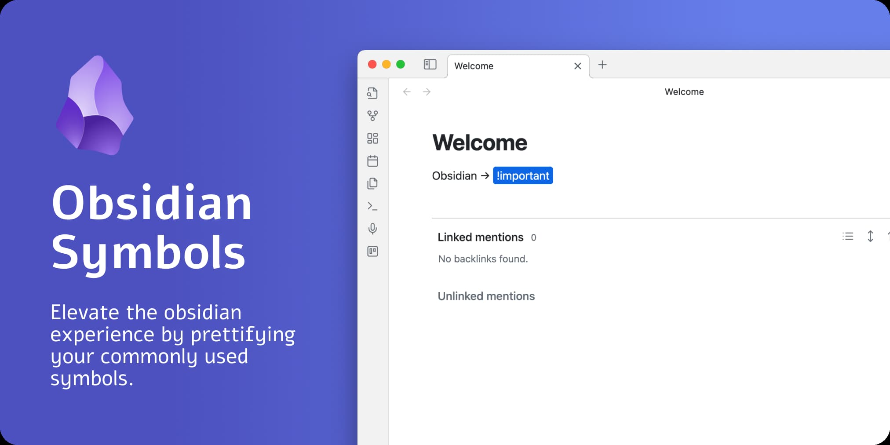
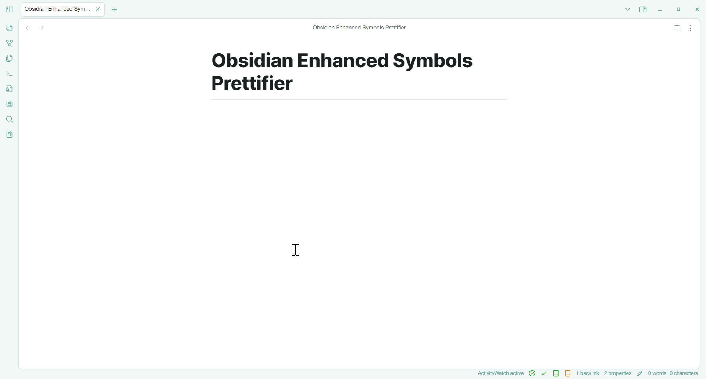
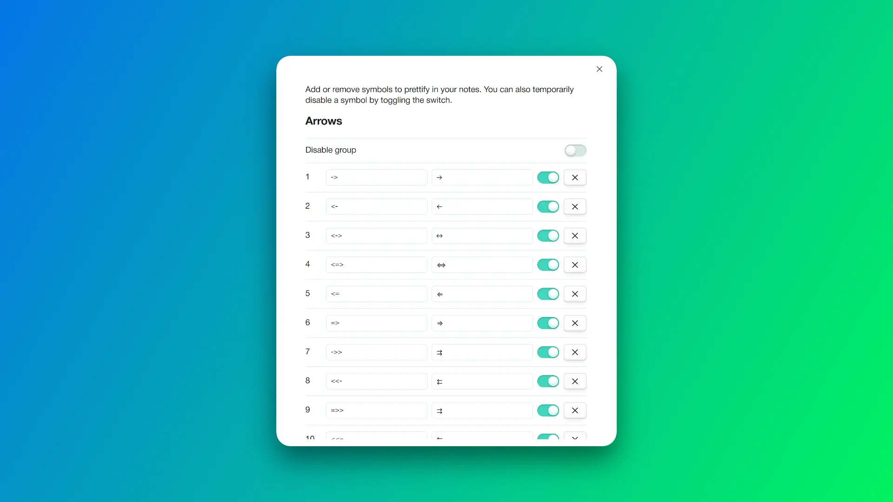
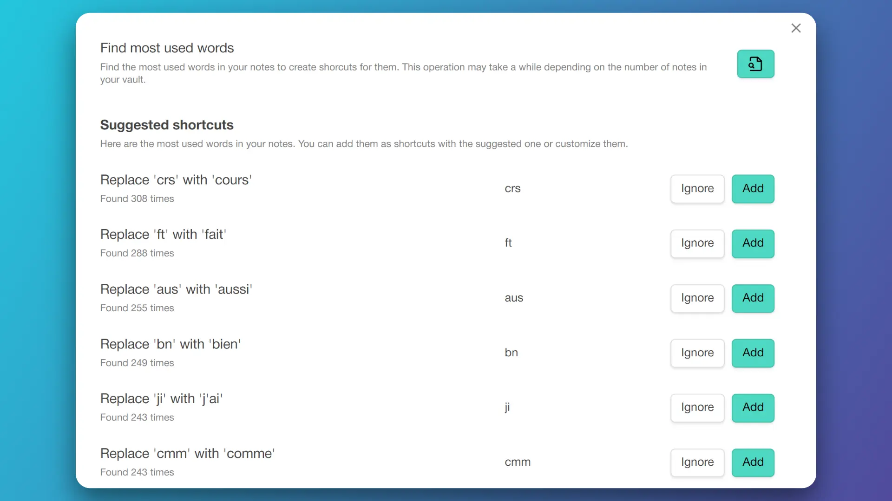

# Obsidian Enhanced Symbols Prettifier



This plugin allows you to **prettify several character combinations** so that these combinations do not look like cryptic symbols. It is also useful for *arrows, abbreviations, greek letters, emojis, maths symbols, etc.*

For instance, if you type `->`, it will be replaced with `→`. If you type `<-`, it will be substituted with `←`. The same goes for all other symbols.



## How to use

The easiest way to use the plugin is to install it and then try to type the following symbols. All of these symbols will be prettified:

`->`, `<-`, `<->`, `<=>`, `<=`, `=>`, `=/=`, etc.

### Customization

If you want to customize the symbols, you can do so by going to the settings of the plugin. There you can add your own symbols and their corresponding prettified symbols or any substitution you want (for instance abbreviations, greek letters, emojis, etc.).



You can also temporarily disable some replacements by using the toggles in the settings.

### Share and find shortcuts

In the [discussion](https://github.com/noam-sc/obsidian-enhanced-symbols-prettifier/discussions/categories/shortcuts) section, you can share your own shortcuts or find new ones that others have shared with the community.

### Shorcuts finder

On top of the settings page, you can find your most used words in your notes to create abbreviations shortcuts for them.



## Installation

### From Obsidian

You can click [this link](obsidian://show-plugin?id=enhanced-symbols-prettifier) to install the plugin directly from Obsidian.

Or you can install the plugin from the Obsidian app by going to `Settings -> Community plugins -> Browse` and then searching for `Enhanced Symbols Prettifier`.

### Manual Installation

To install the plugin manually, you need to download the latest release from the release page. Afterward, you can extract the zip file and copy the folder to your Obsidian vault's plugin directory. You can find the plugin directory by going to `Settings -> Community plugins -> Installed plugins -> Folder icon`.

## After Installation

- You can configure your own shortcuts in the settings of the plugin.
- You may also set up the hotkey "Prettify existing symbols in document" to prettify the symbols in the current note.

## FAQ - Frequently Asked Questions

### Is it replacing the actual characters on the file or just changing how Obsidian displays them?

It is replacing the actual characters in the file. You'll see the prettified characters outside of Obsidian as well.

### Does it work in canvas ?

Yes. Both canvas cards and embedded notes are supported.

### How to undo a replacement?

Press Backspace right after the replacement to undo it. If you just want to press backspace without undoing the replacement, you can press `Shift + Backspace`.

## Development

To customize this project for your needs, you can clone it and then install all dependencies with `yarn`.

After the installation, you need to edit the `env.mjs` file in the root directory. Fill the file with the following content:

```js
export const obsidianExportPath =
  '<path-to-obsidian-vault>/.obsidian/plugins/obsidian-symbols-prettifier';
```

Afterward, you can start the rollup dev server by using `yarn dev`.

This command will automatically build the necessary files for testing and developing every change. Furthermore, it copies all the essential files to the specified plugin directory. It works even better with the [Obsidian Plugin Hot Reload](https://github.com/pjeby/hot-reload).

Finally, you can customize the plugin and add it to your plugins.

## Credits

This plugin is based on the [Obsidian Symbols Prettifier](https://github.com/FlorianWoelki/obsidian-symbols-prettifier) plugin by Florian Woelki.